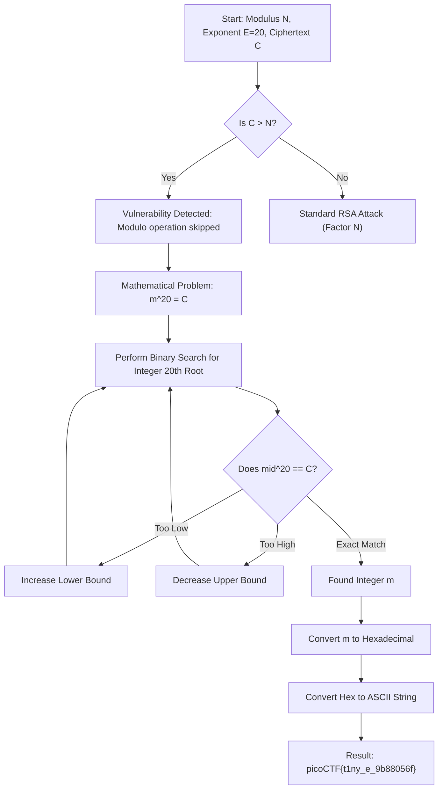

# 🛡️ CTF Writeup: Crack the Power

**Author:** Yahaya Meddy  
**Category:** Cryptography (RSA)  
**Difficulty:** Medium  
**Solution Method:** Small Exponent Nth Root Attack

---

## 1. Challenge Overview
The challenge provides an encrypted message with RSA-like parameters. However, the provided values contain a massive cryptographic flaw that bypasses the need for prime factorization.

**Given Parameters:**
*   **$n$ (Modulus):** A 617-digit number.
*   **$e$ (Public Exponent):** $20$.
*   **$c$ (Ciphertext):** A 1200+ digit number.

---

## 2. Solution Workflow Diagram
This diagram illustrates the logic used to identify the vulnerability and solve the problem.



---

## 3. The Math Behind the Attack
In standard RSA, encryption is $c = m^e \pmod n$. 

1.  **The Flaw:** In this challenge, $c$ is much larger than $n$. This indicates that $m^e$ never reached the "limit" of the modulus $n$, or the modulo operation was entirely omitted.
2.  **The Attack:** This reduces the problem to a simple power function: $c = m^{20}$.
3.  **The Recovery:** To find the message $m$, we calculate the **Integer 20th Root** of $c$. Because $c$ is massive (1200+ digits), we use **Binary Search** to find the exact integer $m$ without losing precision.

---

## 4. Manual Solution: Python Script
This script performs a high-precision binary search to find the exact root and decodes it into the flag.

```python
# Crack the Power - RSA Root Attack
# This script recovers the plaintext when m^e < n or Modulo is missing.

import sys

# Ciphertext provided in the challenge
c = 640637430810406857500566702096274080396661344326148989819149855637707275983472899892750444419300234079892653333362989506852801685008762251130872832744197646466858521890159108234060530632218545536493488645992429077472502031329127700427356736726536701719062158231800255112161983427364020254609533473401843023952968018844806862896943490893119371703331960982414876010742030933003301879372695333343200500711596801923272711473735596859184517981485041587840922031361580523565471754589502606896163103556972744430028454860323232448424368114835718966903896081921822322495308942627206587827869758822635827159743949522778872267782737023325775825987938515587028997868106842378444561485725423380868087876415156656531868887461098120850401515409014096099316919268977722048391610017964961835883458482549333972161386084047586325153495747282557560791442172961910916373381462229380156133838381633915942059818808997063047255803431866226725960708286498794535426919185922421000300087374455173022674406631175145902138929540939977920690014479484669993159370314372551152369559506116674980314595547354085609712390963374849992524368048463233368412763016667750045491935391770001
e = 20

def solve():
    low = 0
    high = c
    m = 0
    
    print("[*] Starting Binary Search for the 20th root...")
    while low <= high:
        mid = (low + high) // 2
        # Calculate mid^20
        p = pow(mid, e)
        
        if p == c:
            m = mid
            break
        elif p < c:
            low = mid + 1
        else:
            high = mid - 1
            
    if m != 0:
        # Convert the large integer m to Hex, then to ASCII bytes
        # [2:] removes the '0x' prefix from the hex string
        hex_val = hex(m)[2:]
        flag = bytes.fromhex(hex_val).decode()
        print(f"[+] Decrypted Flag: {flag}")
    else:
        print("[-] Root not found.")

if __name__ == "__main__":
    solve()
```

---

## 5. Automated Solution: RsaCtfTool
For a faster approach, we can use **RsaCtfTool** in Kali Linux. This tool automates various RSA attacks.

### Installation:
```bash
pipx install git+https://github.com/RsaCtfTool/RsaCtfTool.git
```

### Usage:
Provide the $n$, $e$, and ciphertext $c$ as follows:
```bash
RsaCtfTool -n [N_VALUE] -e 20 --decrypt [C_VALUE]
```
The tool identifies the **Small Exponent** vulnerability and calculates the root automatically.

---

## 6. Conclusion
The challenge was a perfect example of why the **Modulo $n$** and a **Secure Exponent $e$** are vital for RSA. Without them, the encryption is nothing more than simple exponentiation, which can be easily reversed using mathematical roots.

**Flag:** `picoCTF{t1ny_e_9b88056f}`
