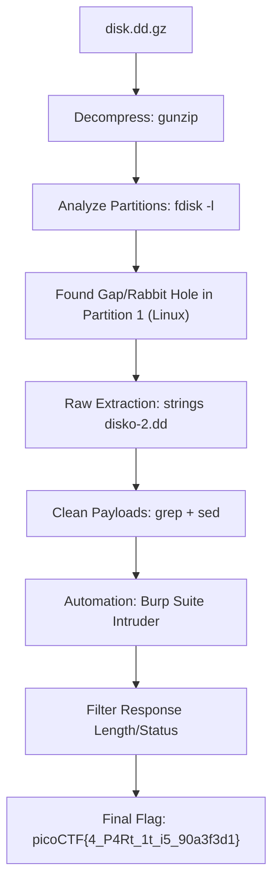

# 🕵️ CTF Writeup: DISKO 2 (Forensics)

**Author:** Darkraicg492  
**Category:** Digital Forensics  
**Difficulty:** Medium  
**Solution Method:** Partition Analysis, Raw String Carving, and Brute-Force Automation.

---

## 1. Challenge Description
The challenge provides a compressed disk image (`disko-2.dd.gz`). The objective is to recover a hidden flag. The hint "The right one is Linux!" and the warning "One wrong step and its all gone!" suggest a hidden or corrupted Linux partition.

---

## 2. Solution Workflow Diagram



---

## 3. Step-by-Step Analysis

### Phase 1: Partition Analysis
After decompressing the image, we examined the partition table:
```bash
fdisk -l disko-2.dd
```
We identified a Linux partition starting at sector **2048**. Calculating the offset ($2048 \times 512 = 1,048,576$), we mounted it but found only a `/bin` directory and a corrupted `lost+found` folder (returning `Bad message` errors).

### Phase 2: String Carving & The "Rabbit Hole"
Traditional forensics mounting failed due to potential intentional filesystem corruption. We pivoted to **Raw Data Carving** using the `strings` utility to find any human-readable text starting with the flag format:
```bash
strings disko-2.dd | grep "picoCTF{"
```
**The Obstacle:** The disk was filled with hundreds of "Fake Flags" following the pattern `picoCTF{4_P4Rt_1t_i5_...}`. This is a classic "Rabbit Hole" meant to prevent manual submission.

### Phase 3: Automation via Burp Suite
To find the one true flag among hundreds of decoys, we automated the submission process.

**1. Preparing the Payloads:**
We needed to extract only the unique string *inside* the curly braces to use in a Burp Suite Intruder "Sniper" attack.
```bash
# Extract full flags, remove 'picoCTF{' and '}', then save unique strings
strings disko-2.dd | grep -oE "picoCTF\{[a-zA-Z0-9_]+\}" | sed 's/picoCTF{//;s/}//' | sort -u > payloads.txt
```

**2. Configuring Burp Intruder:**
*   **Target:** `https://play.picoctf.org/api/submissions/`
*   **Position:** `{"challenge":"506","flag":"picoCTF{§§}"}`
*   **Payload Type:** Simple List (Loaded `payloads.txt`).
*   **Crucial Step:** Unchecked **"URL-encode these characters"** in Settings to ensure curly braces and underscores were sent correctly.

**3. Execution:**
By monitoring the **Response Length** and **HTTP Status Code**, we identified the successful submission. While all fake flags returned a standard "Wrong Flag" response size, the correct payload returned a unique response indicating a successful solve.

---

## 4. The Math Behind the Solve
1.  **Mount Offset:** $Sector \times BlockSize$ ($2048 \times 512$). Essential for bypassing the MBR to read the partition data directly.
2.  **Greedy Regex:** `picoCTF\{[a-zA-Z0-9_]+\}` ensures we capture the entire flag structure across the raw binary data.
---

## 5. Final Flag
`picoCTF{4_P4Rt_1t_i5_90a3f3d1}`

---
### 🛠️ Tools Used:
*   **strings:** For raw data extraction.
*   **sed / grep:** For data cleaning and payload generation.
*   **Burp Suite Professional:** For automated brute-force submission.

